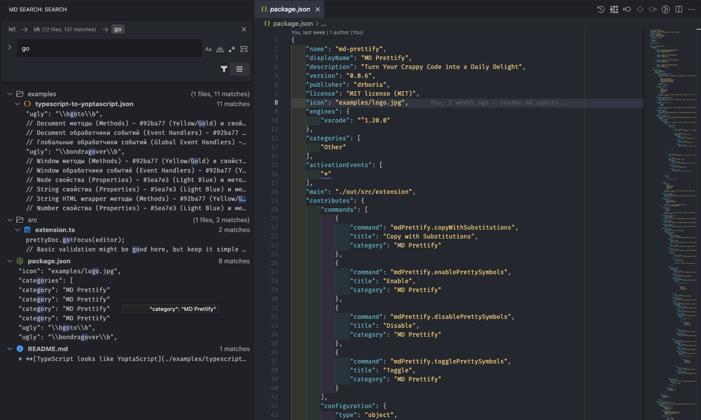

# MD Search

VSCode extension for nested code search and replace functionality

[Download MD Search](https://marketplace.visualstudio.com/items?itemName=drboria.md-search)

## Features

- Powerful search and replace in found matches
- Multiple search modes: text, regex, and structural search
- Live preview of search results
- Support for code transformations in found matches
- Filter results by file or pattern

Based on [astx](https://github.com/codemodsquad/astx) structural search technology

> **Deep Dive:** Want to master regex & capture groups? Check out our [Advanced Search & Regex Guide](docs/SEARCH_CACHE_DEEP_DIVE.md).

## Installation

### From Marketplace

You can install this extension directly from the Visual Studio Code Marketplace:

1. Open VSCode
2. Go to Extensions view (Ctrl+Shift+X / Cmd+Shift+X)
3. Search for "md-search"
4. Click "Install"

### Manual Installation

For manual installation:

1. Download the latest `.vsix` file from the [Releases](/releases) page
2. Run: `code --install-extension path/to/md-search-x.x.x.vsix`

## Usage

1. Open the Search panel from the Activity Bar
2. Enter your search query
3. Optionally configure search settings:
   - Search mode (text, regex, astx)
   - Include/exclude patterns
   - Case sensitivity
   - Search in results
4. Review matches in the results panel
5. Enter replacement text if needed
6. Preview changes before applying
7. Apply changes to selected files

## Keyboard Shortcuts

The extension includes several helpful keyboard shortcuts to enhance your workflow:

| Shortcut (Windows/Linux) | Shortcut (macOS) | Command              | Description                                                  |
| ------------------------ | ---------------- | -------------------- | ------------------------------------------------------------ |
| `Ctrl+Shift+F`           | `Cmd+Shift+F`    | Find                 | Opens the search panel and focuses the find input            |
| `Ctrl+Shift+H`           | `Cmd+Shift+H`    | Replace              | Opens the search panel and focuses the replace input         |
| `Ctrl+Shift+C`           | `Cmd+Shift+C`    | Copy All Matches     | Copies all found matches to clipboard, separated by newlines |
| `Ctrl+Shift+X`           | `Cmd+Shift+X`    | Cut All Matches      | Cuts all found matches and copies them to clipboard          |
| `Ctrl+Shift+V`           | `Cmd+Shift+V`    | Paste to All Matches | Replaces all found matches with clipboard content            |
| `Ctrl+Shift+Z`           | `Cmd+Shift+Z`    | Revert               | Returns to previous state, buffer size is 1 step             |

The copy/cut/paste operations work with multiple matches at once, allowing you to:

- Copy hundreds of matches with a single keystroke
- Cut multiple occurrences across files and paste them elsewhere
- Replace multiple occurrences with either single or multiple values from the clipboard

These shortcuts are active when the search panel has focus.

> **Note:** If keyboard shortcuts don't work, they might conflict with shortcuts from other extensions. You can customize them in VS Code's Keyboard Shortcuts settings (File > Preferences > Keyboard Shortcuts).

> **Performance Note:** When working with a large number of files or matches, operations like Copy All Matches, Cut All Matches, or Paste to All Matches may experience a slight delay. This is normal as the extension processes all matches across multiple files.

## Requirements

- Visual Studio Code 1.60.0 or higher

## Support Me:

If you find this extension useful, please consider donating to support its development:

